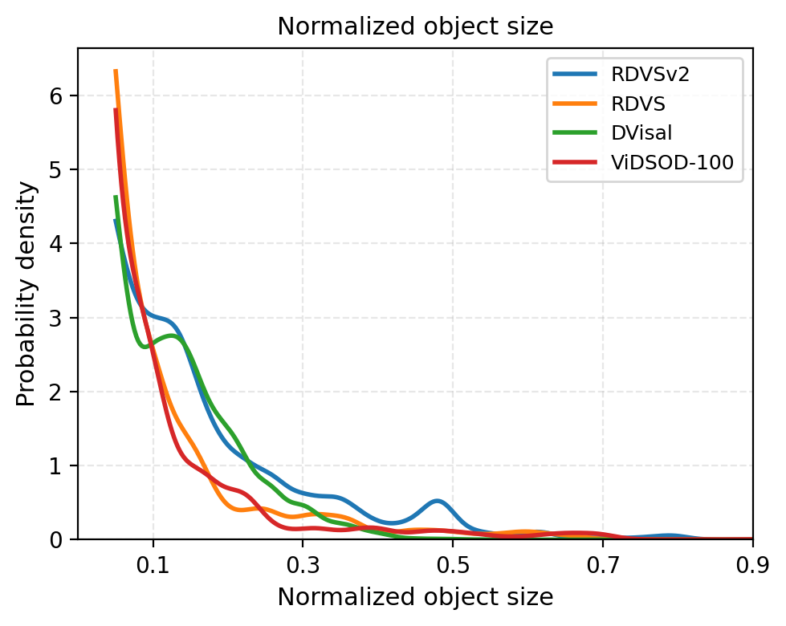
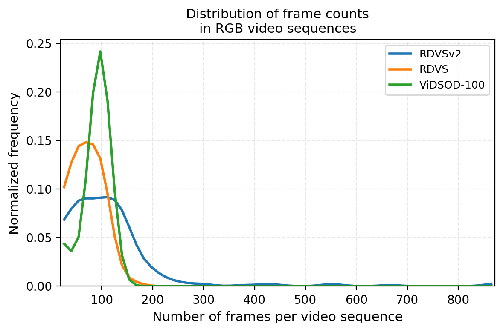
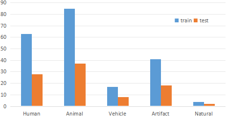
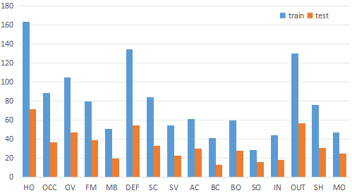
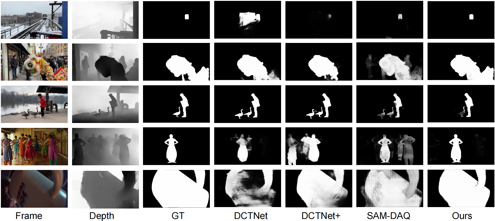
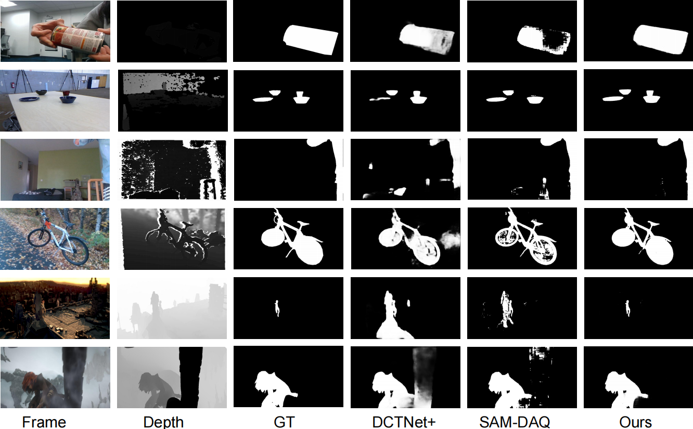
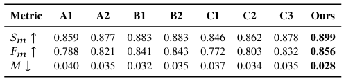

# Supplementary Material for RDVSv2: A Large-scale Benchmark for RGB-D Video Salient Object Detection

This document provides additional details about the paper [RDVSv2: A Large-scale Dataset for RGB-D Video Salient Object Detection]().

## Table of Contents
- [Dataset Annotation](#dataset-annotation)
- [Further Dataset Description and Analysis](#further-dataset-description-and-analysis)
- [Dataset Training/Testing Splits](#dataset-trainingtesting-splits)
- [Quantitative Results](#quantitative-results)
- [Ablation Study](#ablation-study)
---

## Dataset Annotation

Following the eye-tracking-based paradigm established in prior work [1–3], we employ a Tobii Eye Tracker 4C to collect gaze data from participants during free-viewing of video stimuli. The experimental setup remains consistent: the eye tracker operates at a sampling rate of 90 Hz, and visual stimuli are presented on a 23.8-inch screen with a resolution of 1920×1080. Participants use a chinrest to minimize head movement, with a viewing distance of approximately 70 cm maintained throughout the sessions.

To enhance the robustness and generalizability of the annotations, we scale up the participant pool: a total of 22 eligible individuals (14 male, 8 female, aging between 22 and 35) take part in the eye-tracking experiment. All participants pass the eye-tracker calibration procedure, possess normal or corrected-to-normal vision, and have no prior exposure to the video materials. During the experiment, only RGB video frames are displayed; depth information is withheld to avoid influencing visual attention, in line with the annotation protocols of established RGB-D SOD datasets [4–6].

The collected gaze points (of all participants) are processed with a Gaussian filter to generate continuous fixation saliency heatmaps, which subsequently guide the annotation of salient object masks. To handle the substantial scale of the dataset efficiently, we introduce a semi-automatic pipeline that diverges from fully manual annotation. First, trained annotators identify the primary salient objects in each frame using the fixation heatmaps as reference. Then, SAM2 [12] is utilized to perform initial video object segmentation on these candidate regions. Finally, annotators meticulously refine the object boundaries produced by SAM2. This hybrid approach significantly improves annotation efficiency while preserving fine-grained accuracy. Since the annotations are grounded in real gaze data, the resulting dataset naturally captures dynamic saliency shifts, the phenomenon that salient objects may change over time, a property consistent with datasets such as DAVSOD [1].

## Further Dataset Description and Analysis

### Description of Attributes

| Att. | Description |
|------|-------------|
| HO   | *Heterogeneous Object*. Object regions have distinct colors. |
| OCC  | *Occlusion*. Object becomes partially or fully occluded. |
| OV   | *Out-of-view*. Object is partially clipped by the image boundaries. |
| FM   | *Fast-Motion*. The average per-frame object motion, computed as centroids Euclidean distance, is larger than 20 pixels. |
| MB   | *Motion Blur*. Object has fuzzy boundaries due to fast motion. |
| DEF  | *Deformation*. Object presents complex non-rigid deformations. |
| SC   | *Shape Complexity*. Object has complex boundaries such as thin parts and holes. |
| SV   | *Scale-Variation*. The area ratio among any pair of bounding boxes enclosing the target object is smaller than 0.5. |
| AC   | *Appearance Change*. Noticeable appearance variation, due to illumination changes and relative camera-object rotation. |
| BC   | *Background Clutter*. The background and foreground regions around object boundaries have similar colors. |
| BO   | *Big Object*. Ratio of object and image areas becomes larger than 0.25. |
| SO   | *Small Object*. Ratio of object and image areas becomes less than 0.01. |
| IN   | *Indoor Scenes*. Objects are captured in indoor environment. |
| OUT  | *Outdoor Scenes*. Objects are captured in outdoor environment. |
| --- | --- |
| SH   | *Shift*. Attention shifts occur between salient objects. |
| MO   | *Multiple Objects*. There are multiple salient objects. |

**Table 1:** List of video attributes and the corresponding description. We refer to [7, 3] and extend a part of their attributes (top) with four additional general attributes (bottom) regarding extreme object sizes and environments.

### Object Size Distribution

  
  
<b>Fig. 1</b>

Fig. 1 illustrates the distributions of the normalized salient object size which is defined as the ratio of the salient object's pixel area to the total frame area. It can be observed that while the object size ratios in other RGB-D VSOD datasets are heavily concentrated below 0.3, the proportion of extremely small objects in RDVSv2 is relatively lower. Notably, a secondary peak emerges around the ratio of 0.5 in RDVSv2's distribution. This indicates that salient objects in our dataset are, on average, larger in scale. This shift in distribution diversifies the training data and effectively addresses the previous under-representation of medium-to-large salient objects in the field.

### Frame Count Comparison

    
    
<b>Fig. 2</b>

 
We have also compiled statistics on the distribution of video sequence lengths and the ratios of salient object sizes in RDVSv2 alongside other RGB-D VSOD datasets. Fig. 2 presents the distribution of sequence lengths. DViSal [8] is excluded from this comparison due to the lack of per-frame annotations and the generally excessive length of its sequences. The results show that RDVSv2 exhibits a significantly broader range of frame counts. Specifically, the RDVS [3] dataset features a high proportion of sequences with fewer than 100 frames, while sequences in the ViDSOD-100 [9] dataset are primarily clustered around a length of 100 frames. In comparison, RDVSv2 contains a considerably higher proportion of longer videos. This characteristic provides richer and more varied training samples, making it particularly suitable for developing models that require long-term temporal modeling.

## Dataset Training/Testing Splits

  

    
    
<b>Fig. 3</b>

  

  

    
    
<b>Fig. 4</b>

  

As shown in Fig. 3 and Fig. 4, the quantities of object categories and attributes are partitioned into training and test sets following an approximate 7:3 ratio.

## Quantitative Results
### Qualitative Comparison on RDVSv2 Test Set after Fine-tuning.

  
  
<b>Fig. 5</b>

For qualitative evaluation, in Fig. 5, we present a qualitative comparison of our method against three other SOTA models (DCTNet [10], DCTNet+ [3], and SAM-DAQ [11]), all fine-tuned on the RDVSv2 training set and evaluated on its test set. It can be observed that our method achieves superior performance in salient object identification and segmentation, particularly for large objects.

### Quantitative Comparison with SOTA Methods.

  
  
<b>Fig. 6</b>

The quantitative results on the three RGB-D VSOD datasets are shown in Fig. 6. As can be observed, our model also achieves superiority in both salient object identification and the quality of salient object segmentation.

## Ablation Study

  
  
<b>Table 2: Ablation study on RDVS dataset</b>

We conduct two ablation studies. Since prior SAM2-based methods utilize only RGB and depth modalities without incorporating optical flow, we first verify that our superiority does not stem solely from the additional motion modality. To this end, we adapt our model to accept only RGB and depth inputs (denoted B1) and compare it with two variants of SAM-DAQ: SAM-DAQ with its memory module removed to eliminate temporal modeling (denoted A1) and the original SAM-DAQ which retains temporal modeling (denoted A2). SAM-DAQ represents the current best-performing SAM2-based methods that also use only RGB and depth modalities. As shown in Table 2, variant B1 exhibits a performance drop compared to our full model, yet it still achieves SOTA results, outperforming both A1 and A2. Similarly, we evaluate a variant that retains optical flow while removing depth (denoted B2), which also achieves SOTA performance, outperforming A2. This outcome not only confirms the effectiveness of our core architectural design but also justifies the rational inclusion of optical flow for enhanced spatiotemporal modeling.

We then evaluate the effectiveness of the two core modules in our model: CP and LoRA. We conduct ablation experiments by removing each module individually. We denote the variant with both modules removed as C1, the variant with only LoRA removed as C2, and the variant with only CP removed as C3. The results show that both ablations lead to performance degradation compared to the full model. Compared to the baseline that retains only SAM2 (with both modules removed), incorporating LoRA yields a substantial performance gain, while adding CP alone provides only a limited improvement. This may be attributed to the fact that the three parallel LoRA modules help the model capture distinctions among the three modalities, thereby better adapting the pre-trained SAM2—which was not originally trained on depth or optical flow—to these modalities. Consequently, relying solely on the CP module to identify and fuse inter-modal commonalities proves insufficient. However, when CP is introduced in addition to LoRA, the two modules complement each other, leading to further performance gains and achieving the best performance. In addition, a single LoRA is used instead of the three parallel LoRA module as C4, which also performs worse than the full model,further confirming the effectiveness of parallel LoRA. 

---

## References

[1] D.-P. Fan, W. Wang, M.-M. Cheng, and J. Shen, “Shifting more attention to video salient object detection,” in <em>Proceedings of the IEEE/CVF Conference on Computer Vision and Pattern Recognition (CVPR)</em>, 2019, pp. 8554–8564.

[2] W. Wang, J. Shen, J. Xie, M.-M. Cheng, H. Ling, and A. Borji, “Revisiting video saliency prediction in the deep learning era,” <em>IEEE Transactions on Pattern Analysis and Machine Intelligence</em>, vol. 43, no. 1, pp. 220–237, 2019.

[3] A. Mou, Y. Lu, J. He, D. Min, K. Fu, and Q. Zhao, “Salient object detection in RGB-D videos,” <em>IEEE Transactions on Image Processing</em>, vol. 33, pp. 6660–6675, 2024.

[4] D.-P. Fan, Z. Lin, Z. Zhang, M. Zhu, and M.-M. Cheng, “Rethinking RGB-D salient object detection: Models, data sets, and large-scale benchmarks,” <em>IEEE Transactions on Neural Networks and Learning Systems</em>, vol. 32, no. 5, pp. 2075–2089, 2020.

[5] H. Peng, B. Li, W. Xiong, W. Hu, and R. Ji, “RGBD salient object detection: A benchmark and algorithms,” in <em>European Conference on Computer Vision (ECCV)</em>, 2014, pp. 92–109.

[6] N. Liu, N. Zhang, L. Shao, and J. Han, “Learning selective mutual attention and contrast for RGB-D saliency detection,” <em>IEEE Transactions on Pattern Analysis and Machine Intelligence</em>, vol. 44, no. 12, pp. 9026–9042, 2021.

[7] F. Perazzi, J. Pont-Tuset, B. McWilliams, L. Van Gool, M. Gross, and A. Sorkine-Hornung, “A benchmark dataset and evaluation methodology for video object segmentation,” in <em>Proceedings of the IEEE Conference on Computer Vision and Pattern Recognition (CVPR)</em>, 2016, pp. 724–732.

[8] J. Li, W. Ji, S. Wang, W. Li, et al., “DVSOD: RGB-D video salient object detection,” in <em>Advances in Neural Information Processing Systems (NeurIPS)</em>, vol. 36, pp. 8774–8787, 2023.

[9] J. Lin, L. Zhu, J. Shen, H. Fu, Q. Zhang, and L. Wang, “VidSOD-100: A new dataset and a baseline model for RGB-D video salient object detection,” <em>International Journal of Computer Vision</em>, vol. 132, no. 11, pp. 5173–5191, 2024.

[10] Y. Lu, D. Min, K. Fu, and Q. Zhao, “Depth-cooperated trimodal network for video salient object detection,” in <em>2022 IEEE International Conference on Image Processing (ICIP)</em>, pp. 116–120, 2022.

[11] J. Lin, X. Zhou, J. Liu, R. Cong, G. Zhang, Z. Liu, and J. Zhang, “SAM-DAQ: Segment Anything Model with Depth-guided Adaptive Queries for RGB-D Video Salient Object Detection,” in <em>Proceedings of the 40th AAAI Conference on Artificial Intelligence (AAAI)</em>, Singapore, Jan. 2026. (accepted)

[12] N. Ravi, V. Gabeur, Y.-T. Hu, R. Hu, C. Ryali, T. Ma, H. Khedr, R. Rädie, C. Rolland, L. Gustafson, et al., “SAM 2: Segment anything in images and videos,” <em>arXiv preprint arXiv:2408.00714</em>, 2024.
